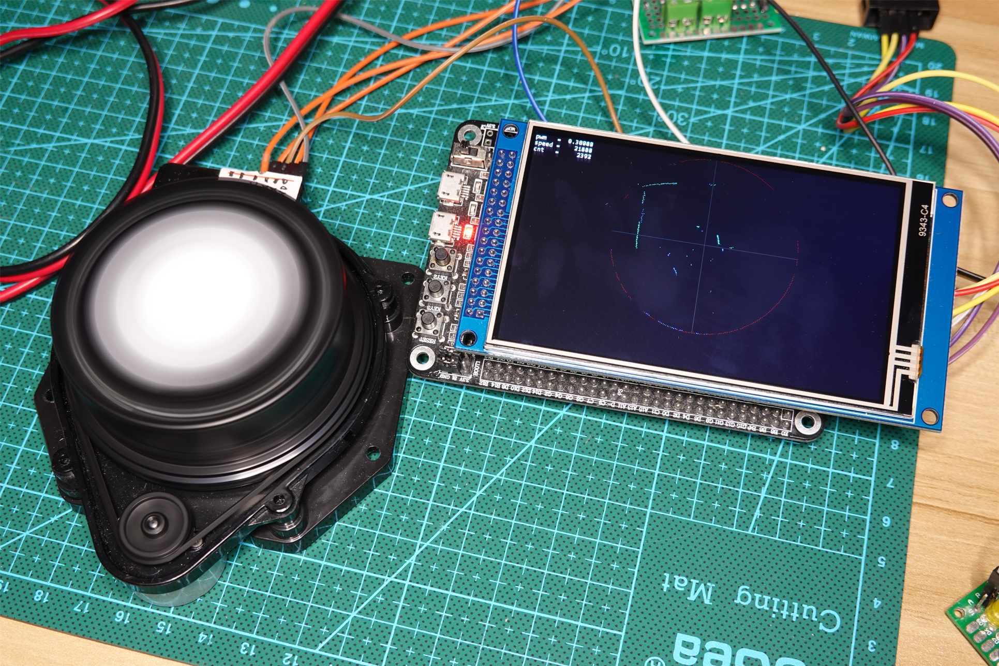
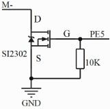

# Laser Radar LDS-006 Drive Test for STM32F4
---
### 1、介绍
激光雷达LDS-006的简单驱动测试代码。
本项目中关于激光雷达的相关参数以及解码方式均为扫描和推理得出，仅供学习参考。
### 2、平台：
- IDE: STM32CubeIDE 1.7.0
- MCU: STM32F407ZGT6
- LCD: MRB3973 (Chip: NT35510)

### 3、已实现:
- 雷达数据解码和显示
- 外接MOS方式的雷达转速控制

### 4、待实现:
- 使用雷达自身的MCU进行转速控制

### 5、驱动方法:
#### 接口定义:
| Radar   | MCU     | Note            |
| ---     | ---     | ---             |
| M+      |         | Motor V+        |
| M-      |         | Motor V-        |
| VCC     |         | Vcc +5V         |
| RX      | PA2     | UART Receive    |
| TX      | PA3     | UART Transmit   |
| GND     | GND     |                 |

暂时没扫描出启动雷达电机的指令，所以暂时外接一个MOS管，MOS管栅极接单片机PE5(TIM9_CH1)，使用PWM控制电机转速。
注：雷达电路已经包含了续流二极管。

| LCD   | MCU   | Note                |
| ---   | ---   | ---                 |
| CS    | PG12  | FSMC_NE4            |
| RS    | PF12  | FSMC_A6             |
| WR    | PD5   | FSMC_NWE            |
| RD    | PD4   | FSMC_NOE            |
| RST   | NRST  |                     |
| DB0   | PD14  | FSMC_D0             |
| DB1   | PD15  | FSMC_D1             |
| DB2   | PD0   | FSMC_D2             |
| DB3   | PD1   | FSMC_D3             |
| DB4   | PE7   | FSMC_D4             |
| DB5   | PE8   | FSMC_D5             |
| DB6   | PE9   | FSMC_D6             |
| DB7   | PE10  | FSMC_D7             |
| DB8   | PE11  | FSMC_D8             |
| DB9   | PE12  | FSMC_D9             |
| DB10  | PE13  | FSMC_D10            |
| DB11  | PE14  | FSMC_D11            |
| DB12  | PE15  | FSMC_D12            |
| DB13  | PD8   | FSMC_D13            |
| DB14  | PD9   | FSMC_D14            |
| DB15  | PD10  | FSMC_D15            |
| BL    | PB15  | Back Light Control  |

#### 雷达控制指令
目前只扫描出一个指令：
| Command | Description |
| ---     | ---         |
| 0x24    | 启动读数 |

### 6、数据结构
- 刚启动时的返回数据结构:
  | Byte  | Value   | Description |
  | ---   | ---     | ---         |
  | 0x00  | 0x5A    | 数据头 |
  | 0x01  | 0xA5    | 数据头 |
  | 0x02  |         | 距离高8位 |
  | 0x03  |         | 距离低8位 |
  在雷达上电后发送0x24会收到如上的数据，距离数据为毫米单位的整形数据，数据会在距离发生变化时更新，注意这里大端小端模式和和正常数据的相反。

- 雷达旋转后的数据结构:
  | Byte  | Value | Description |
  | ---   | ---   | ---         |
  | 0x00  | 0xFA  | 数据帧头 |
  | 0x01  | 0xFB, 0xA0 ~ 0xF9  | 数据帧号，0xFB: 速度错误, 0xA0 ~ 0xF9: 角度 |
  | 0x02  | | 转速低8位 |
  | 0x03  | | 转速高8位 |
  | 0x04  | | #0距离低8位 |
  | 0x05  | | #0距离高8位 |
  | 0x06  | | #0反射率低8位 |
  | 0x07  | | #0反射率高8位 |
  | 0x08  | | #1距离低8位 |
  | 0x09  | | #1距离高8位 |
  | 0x0A  | | #1反射率低8位 |
  | 0x0B  | | #1反射率高8位 |
  | 0x0C  | | #2距离低8位 |
  | 0x0D  | | #2距离高8位 |
  | 0x0E  | | #2反射率低8位 |
  | 0x0F  | | #2反射率高8位 |
  | 0x10  | | #3距离低8位 |
  | 0x11  | | #3距离高8位 |
  | 0x12  | | #3反射率低8位 |
  | 0x13  | | #3反射率高8位 |
  | 0x14  | | 校验和低8位 |
  | 0x15  | | 校验和高8位 |
  - 雷达数据每一帧以0xFA为起始
  - 第二个字节代表角度，角度数据减去0xA0后乘上4为当前帧对应的角度，单位°
  - 第三和第四字节为速度，正常的转速在21500附近，速度较高或较低时都不会返回正确的雷达数据，且第二个字节始终返回0xFB；
  - 之后为4个雷达数据，每一个雷达数据包含一个以毫米为单位的距离数据和一个单位未知的反射率数据。
  - 最后的校验和为该帧除了校验位以外的所有字节的算数和。

### 7、代码
施工中...